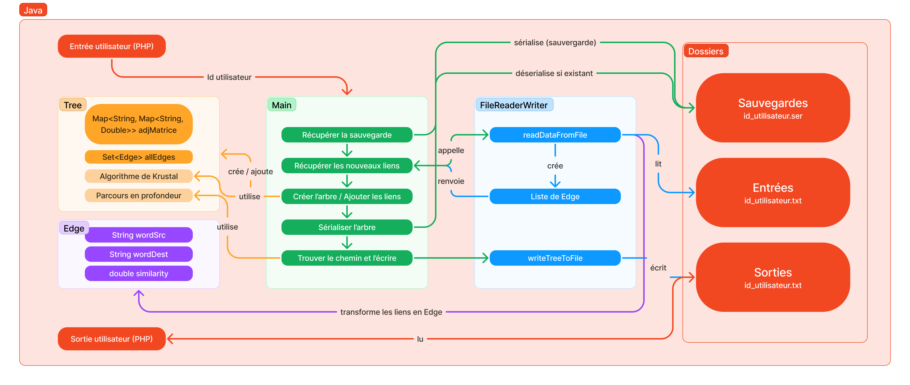

<h1 align="center">Moteur de chaine | Links Awordkening</h1>

<br>

##  Technologies utilisées pour ce module
[](https://skillicons.dev)
[](https://skillicons.dev)

## Objectif de ce module
Le module Java aussi appelé moteur de chaîne à pour objectif de créer un arbre couvrant de poids maximal afin de trouver le meilleur chemin possible entre un mot A et un mot B puis de renvoyer le score associé pour le joueur. On utilise une variante de l'algorithme de Krustal afin de créer l'arbre en supprimant les arêtes les moins intéressante. En plus de cela, nous utilisons également un algorithme de parcours en profondeur modifié afin de trouver le meilleur chemin entre les mots.

## Fonctionnement du code


## Compilation et exécution

### - Compilation -
Si le .jar n'existe pas, il suffit de taper cette commande à la racine du projet `Java` :
```bash
mvn clean package
```
### - Exécution -
Une fois compilé il vous suffit d'appeler le fichier .jar comme ceci (n'oubliez pas l'argument) :
```bash
java -jar <PATH TO JAR>/<NAME-VERSION>.jar <ID_USER>
```
A titre d'exemple dans notre code en se plaçant dans le dossier `Game` on effectue :
```bash
java -jar Java/target/ChainEngine-2.0.jar 1478
```