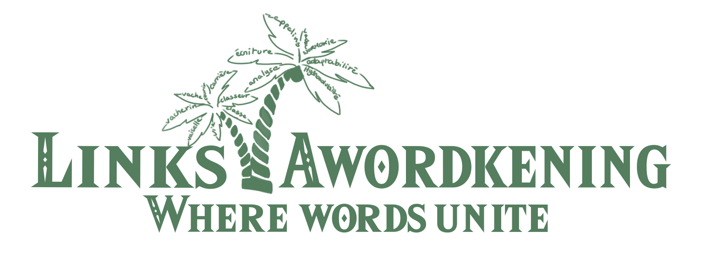
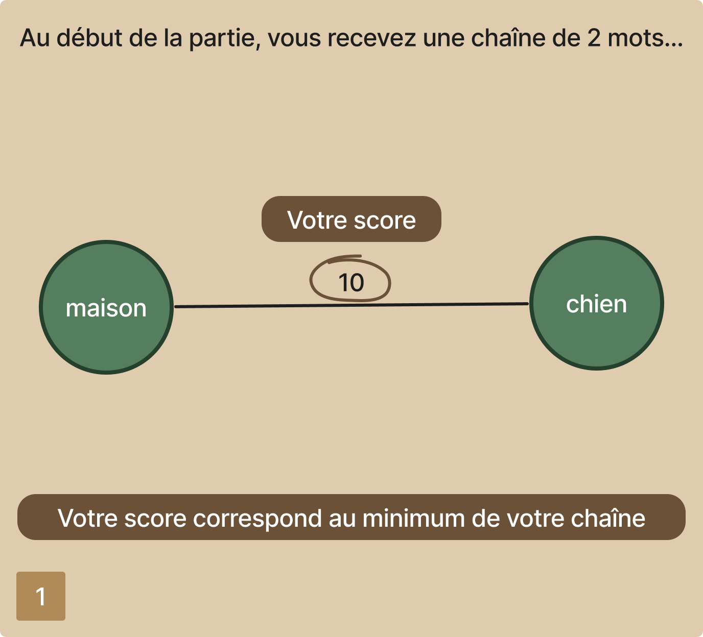
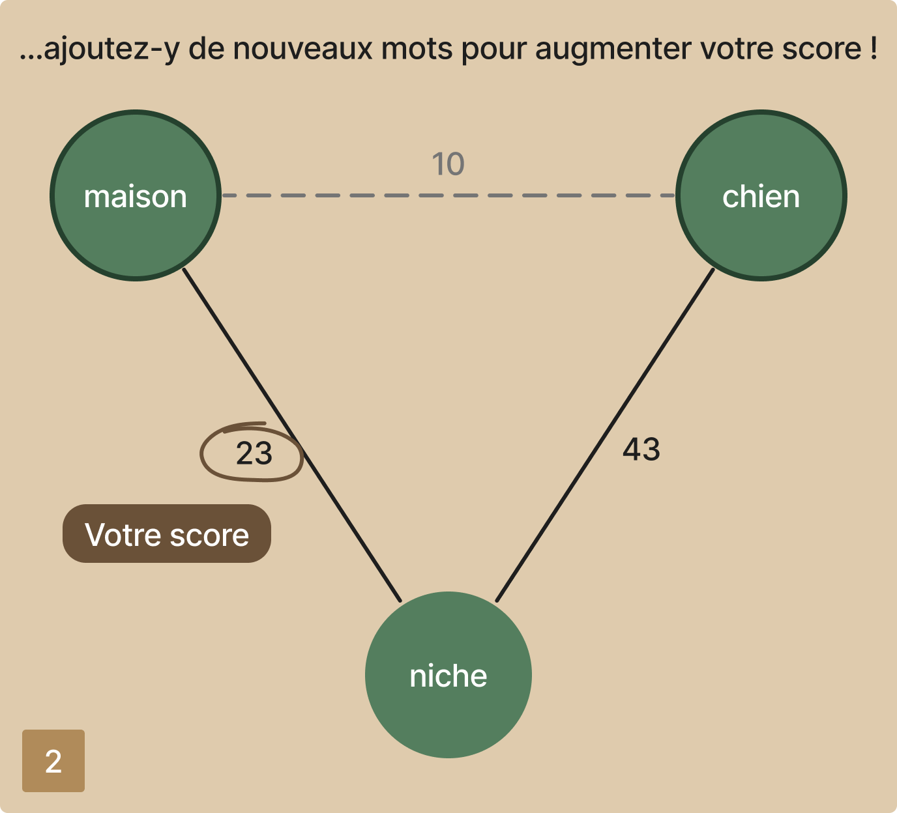
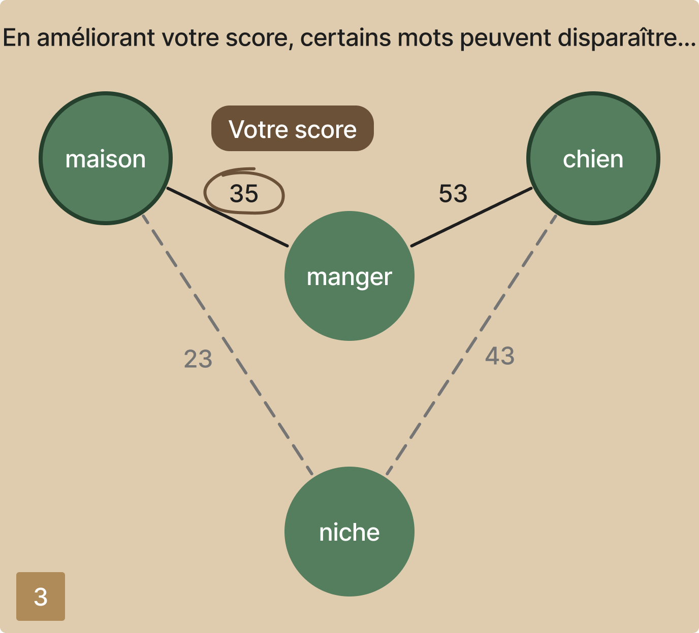
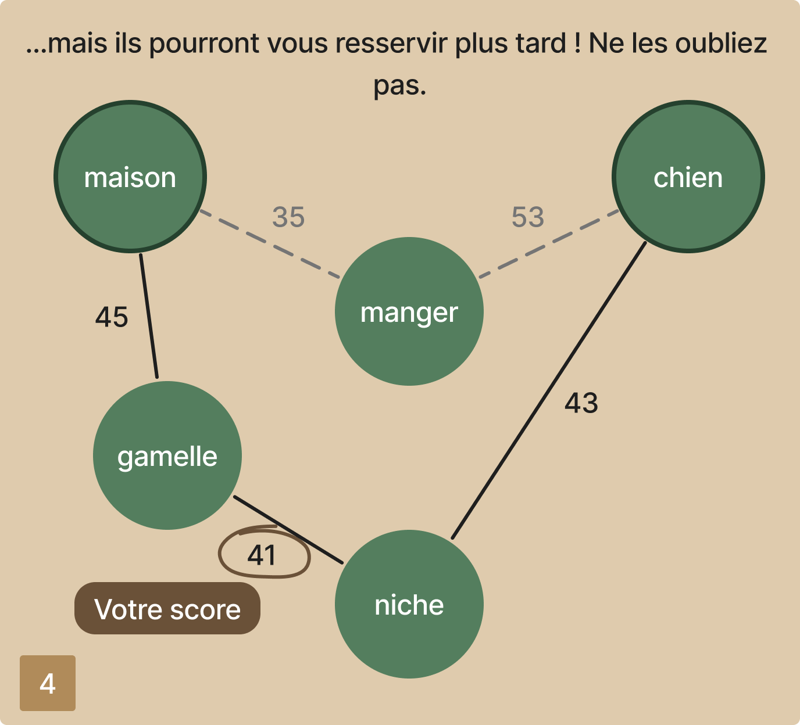

# Links Awordkening 
<p align="center">
    
</p>


<p align="center" style="font-size:15px;">
🌿 Venez défier votre esprit <span style="color: #6A5138">seul</span> ou en <span style="color: #D2B48C">famille</span> avec des <span style="color: #82a14e">chaînes de mots</span> et explorez un monde remplie de <span style="color: #547E5E">liens</span> pour relever le défi ultime du <span style="color: #F4E9CD">langage</span> ! 💬 
</p>
<br>
<p align="center"><a href="https://linksawordkening.fabiengilles.tf" style="display: inline-block; padding: 10px 20px; background-color: #4CAF50; color: white; text-decoration: none; border-radius: 5px;">Jouer au jeu !</a></p>

## Règles : 

<table class="center-table">
  <tr class="rule-row">
    <td class="rule-cell"></td>
    <td class="rule-cell"></td>
  </tr>
  <tr class="rule-row">
    <td class="rule-cell"></td>
    <td class="rule-cell"></td>
  </tr>
</table>

## Technolgies nécessaires : 

Technolgie | Version | Partie associée |
------- | ------ | -------
<span style="color: #68A063">Node.js<span> | ``20.12`` | Site react
<span style="color: #CB3837">NPM</span> | ``10.5`` | Site react
<span style="color: #885630">Composer</span> | ``2.7`` | API PHP
<span style="color: #777BB4">PHP</span> | ``8.2`` | API PHP
<span style="color: #B22222">Java</span> | ``19`` | Moteur de jeu
<span style="color: #FFD343">Python</span> | ``3.12`` | Serveur jeu multijoueur

## Installation :

### - Site -

Importez le fichier SQL pour la base de données : <a href="./data/linksawordkening-db.sql">linksawordkening-db.sql</a>

Renommez le fichier ``dev-configuration.php`` en ``configuration.php``

Depuis le dossier `api` :

```bash
composer update
```

Depuis le dossier `api/mail` :

Installer PHPMailer

Depuis le dossier `frontend` : 

```bash
npm install
npm start
```

### - Multijoueur -

Lire la documentation dans `Game/server` : <a href="./Game/server/README.md">README.md</a>

### - Annexes -

Pour ``convertir`` un fichier du format ``Windows (CRLF)`` au format ``Unix (LF)`` :

```bash
dos2unix <FICHIER>
```

Si vous souhaitez ``build`` le projet React :

```bash
npm install -g dotenv-cli
npm run build
```

## Retrouvez l'équipe LinksAwordkening (FC-Rats) !
[@Artena8](https://github.com/Artena8) - Hélèna Chevalier<br>
Développeuse <span style="color: #61DAFB">#React</span> <span style="color: #A8B9CC">#C</span><br>
Designer <span style="color: red">#</span><span style="color: orange;">V</span><span style="color: yellow;">i</span><span style="color: green;">v</span><span style="color: blue;">e</span><span style="color: indigo;">L</span><span style="color: violet;">e</span><span style="color: red;">D</span><span style="color: orange;">e</span><span style="color: yellow;">s</span><span style="color: green;">s</span><span style="color: blue;">i</span><span style="color: indigo;">n</span>

[@widfleer](https://github.com/widfleer) - Loélia Coutellier<br>
Développeuse <span style="color: #61DAFB">#React</span> <span style="color: #777BB4">#PHP</span>

[@InkyYuu](https://github.com/InkyYuu) - Kellian Bredeau<br>
Développeur <span style="color: #FFD343">#Python</span> <span style="color: #B22222">#Java</span>

[@LeoDessertenne](https://github.com/LeoDessertenne) - Léo Dessertenne<br>
Développeur <span style="color: #61DAFB">#React</span> <span style="color: #F29111">#SQL</span>

[@TheIceMagmaCube](https://github.com/TheIceMagmaCube) - Fabien Gilles<br>
IT Boy <span style="color: #FFD700">#Serveur</span> <span style="color: #0DB7ED">#Docker</span>

<br>
<h3 style="text-align:center;">Toute l'équipe LinksAwordkening vous remercie de votre soutien !</h3>
<h5 style="text-align:center;">Copyright @FC-Rats<h5>
<p align="center">
    
</p>
